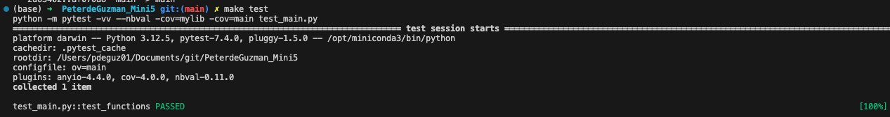

 # This is a README for IDS 706 Mini Project 6

### Status Badge:


### Summary and Project Motivation:
In this project, 

### Data Used in this Project:
This project uses data on 

More information and a link to the data is available at: 

### Structure:
- In the `mylib` directory, `extract.py` extracts the raw data from the link to the NCSBE website. The `transform_load.py` script transforms the raw data from `.csv` to a `.db` SQLite database and creates a new connection.
- The `query.py` script includes the Create, Read, Update, and Delete (CRUD) operations to execute various SQL operations. 

### Proof of Successful Database Operations
- Please view the "main.ipynb" notebook to view proof of successful database operations. 

### Test:



### Project Directory:
```
PeterdeGuzman_Mini6/
├── __pycache__/
├── .devcontainer/
│   ├── devcontainer.json
│   └── Dockerfile
├── .pytestcache/
├── .ruff_cache/
├── __pycache__
├── .github/
│   └── workflows/
│       └── cicd.yml
├── mylib/
│      ├── extract.py
│      ├── transform_load.py
│      └── query.py
├── data/
│       └── pollingplaces_2020.csv
├── .gitignore
├── proof_test.png
├── pllingplaces_2020.db
├── main.py
├── main.ipynb
├── main.html
├── main.pdf
├── Makefile
├── README.md
├── Requirements.txt
└── test_main.py
```


