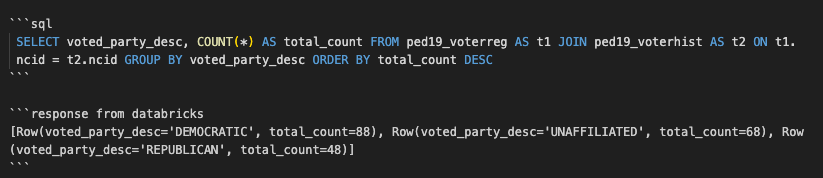

 # This is a README for IDS 706 Mini Project 6

### Status Badge:
[](https://github.com/nogibjj/PeterdeGuzman_Mini6/actions/workflows/cicd.yml)

## Summary and Project Motivation:
- The goal of this project was to create an ETL-Query (Extract, Transform, Load, Query) pipeline using Python and Databricks to join and query individual-level voter registration and vote history data for North Carolina. 
- I extracted data from the NC State Board of Elections website, cleaned and transformed the data into a standard UTF-16 tab-separated CSV format, and loaded the data into a Databricks warehouse. 
- Finally, I was able to establish a connection to Databricks and query the data directly to perform joins, aggregations, and sorting operations. 

### Data Used in this Project:
This project uses data on voter registration and vote history for individuals in Durham County, North Carolina. 

More information and a link to the data is available at: 
- https://www.ncsbe.gov/results-data/voter-registration-data
- https://www.ncsbe.gov/results-data/voter-history-data 

### Structure of ETL-Query Pipeline:
- In the `mylib` directory, `extract.py` extracts the raw data from the link to the NCSBE website. 
    - The `extract_zip()` function takes in a URL and a destination directory name and creates a filepath for a zipped file, downloads the zipped file, and extracts the file to the named destination directory.
    - The `test_encoding_zippedfile()` function takes in a URL for a zipped `.txt` file, downloads the file, and checks the encoding. The `check_txtencoding_directory()` function takes a directory and checks the encoding for each `.txt` file in the directory. This function can be easily updated to check the encoding of `.csv` files. 
- The `transform_load.py` script performs multiple cleaning and transforming operations to prepare the data to be loaded into the Databricks database.
    - Both functions `transform_voterreg()` and `transform_votehistory()` take in their respective downloaded datasets as arguments, along with the name of a county, the date of transformation, and the destination directory. The functions check the column names against a pre-defined list of expected column names, and transforms the datasets into UTF-16 encoded tab-separated CSVs. 
    - The above step was necessary because voter registration data in North Carolina is saved in the "Windows-1521" encoding. Vote history data is saved as "UTF-8" encoding. 
    - The `trim_dataset()` function was used to sort the data by "ncid" (North Carolina ID) and reduce each dataset to a set number of observations for testing. 
    - Both `load_voterreg()` and `load_votehistory()` functions take in a dataset as an argument before reading them line by line into a iterable reader object. Then, using the `python-dotenv` module, we connect to the Databricks warehouse and check for existing tables. If no table exists, we create a new table with a pre-defined schema, and insert each line of the csv reader object into the table. Once this is completed, we close the connection to conserve resources. 
- Finally, the `query.py` script includes the `general_query()` function required to execute various SQL operations. This function connections to the Databricks warehouse and takes in a SQL query formatted as a string. 
    - This script also includes a `log_query()` helper function that is included in the `general_query()` function to record the syntax and result of each SQL query. 


### Proof of Query and Explanation:


- This query retrieves data from our two tables (ped19_voterreg and ped19_voterhist), performs an inner join based on the "ncid" column, groups the data by the party the individual voted for, and orders the count for each party in descending order. 
- Note: To perform this operation within our server warehouse limit, I trimmed the voter registration and vote history datasets to the first 5,000 observations. 

### Project Directory:
```
PeterdeGuzman_Mini6/
├── __pycache__/
├── .devcontainer/
│   ├── devcontainer.json
│   └── Dockerfile
├── .pytestcache/
├── .ruff_cache/
├── __pycache__
├── .github/
│   └── workflows/
│       └── cicd.yml
├── mylib/
│      ├── extract.py
│      ├── transform_load.py
│      └── query.py
├── data/
├── data_documentation
├── .gitignore
├── proof_test.png
├── main.py
├── Makefile
├── README.md
├── Requirements.txt
└── test_main.py
```


